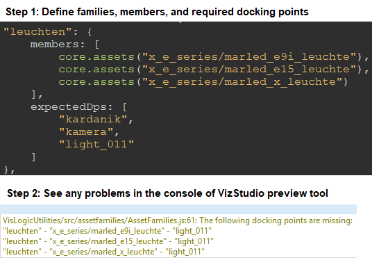

# AssetFamilies

A module to verify that certain visual assets have certain docking points. 
Useful when you have many variants of a part (e.g. a bike saddle) that are all docked the same way.



For a detailed documentation of the public functions, please see the JSDoc comments
in [src/assetfamilies/AssetFamilies.js](src/assetfamilies/AssetFamilies.js).

## Using AssetFamilies in VisLogic

```javascript
//anywhere in vislogic
//import
import { AssetFamilies } from "./VisLogicUtilities/src/assetfamilies/AssetFamilies.js";
//prepare data object of families, members and expected docking points
let myFamilies = {
	"saddles": {
		members: [
			core.assets("saddle1"),
			core.assets("saddle2"),
			core.assets("saddle_thirdparty")
		],
        expectedDps: [
			"connector",
            "clamp"
        ]
    },
    "bikeframes": {
		members: [
			core.assets("frame_big"),
            core.assets("frame_small")
        ],
        expectedDps: [
			"saddle",
            "wheel_front",
            "wheel_rear"
        ]
    }
}
//use
AssetFamilies.verify(myFamilies);
```

## Public Functions
These are the supported public functions you can use in your code.
For function parameters, see below.

| Function name | Description                                                     |
|---------------|-----------------------------------------------------------------|
| `verify`      | Runs the verification for the supplied object of asset families |


## Parameters for verify(families)

* families - The object of families to test. See code in the example above of an example.
* Property names of this family object are the names of the families. Its value is a family object, which in turn requires two properties: "members" of type Assets[] and "expectedDps" of type String[].