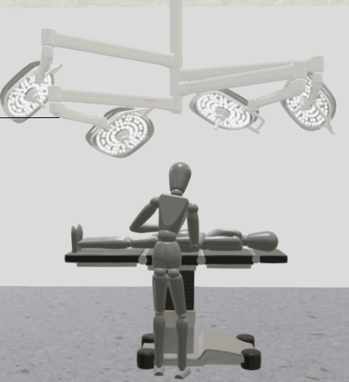
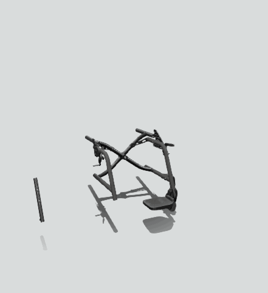

# DockingTreeAnimation

A module for automatically animating the docking hierarchy in a project.






This module offers a very quick and automatic way of animating a complete docking hierarchy. 
It comes at a cost of not being able to customize the order of animations and many other things you might want to customize for your project.

For a detailed documentation of the public functions, please see the JSDoc comments
in [src/dockingtreeanimation/DockingTreeAnimation.js](src/dockingtreeanimation/DockingTreeAnimation.js).

## Using DockingTreeAnimation in VisLogic

```javascript
//any file in vislogic
//import
import { DockingTreeAnimation } from "./VisLogicUtilities/src/dockingtreeanimation/DockingTreeAnimation.js";
//use
//...
//code that creates any sort of docking hierarchy. Can also include dockingTranslations.
//...
//After the docking hierarchy is established, call the play function
DockingTreeAnimation.play({
    offsetVector: [-1, 0, 0],
    manipulatorFunction: function (offsetVector, sceneObject) {
		let result = offsetVector.slice();
		//example use case: all sceneObjects which have an "e" in their asset name should fly in from a different direction
		if (sceneObject.asset.name.includes("e")) {
			result[0] *= -1;
		}
		return result;
    },
    totalDuration: 15
});
```

## Parameter Object

The only public function `play` uses a parameter object to customize the animation.  
It supports the following properties:

| Property            | Value type    | Default Value          | Description                                                                                                                                                                                                                         |
|---------------------|---------------|------------------------|-------------------------------------------------------------------------------------------------------------------------------------------------------------------------------------------------------------------------------------|
| offsetVector        | Array(Number) | [1, 0, 0]              | Optional. A 3D-Vector by which each sceneObject will moved (translation) before starting the animation                                                                                                                              |
| manipulatorFunction | Function      | undefined              | Optional. See below.                                                                                                                                                                                                                |
| totalDuration       | Number        | -1                     | Optional. Time in seconds it will take for all animations to run. Needs to be a positive number. If no value is supplied, each individual animation will take 1 second. The total then depends on the number of dockings/animations |

## Manipulator Function

The manipulator function is an optional parameter object property which allows you to manipulate the offsetVector for each individual sceneObject.
A potential use case is that parts on the left side of your configured product should fly in from the left, and parts on the right side from the right.
It has 2 parameters:
* offsetVector - Array(Number) - The original offset Vector. Even if you have not specified one, it will be the default offsetVector
* sceneObject - SceneObject - SceneObject from the Viz API that is currently being animated.

The return value of this function is also an Array(Number) and represents the offsetVector that will be used for this specific SceneObject

```javascript
function manipulatorFunction (offsetVector, sceneObject) {
	let result = offsetVector.slice(); //copy offsetVector
	let connectingDp = sceneObject.getDockingInfo().ownDp;
	if(connectingDp !== "" && sceneObject.dockingPoints[connectingDp].position[0] < 0){ //negative x coordinate
		result[0] *= -1; //flip sign of x coordinate
	}
	return result;
}
```