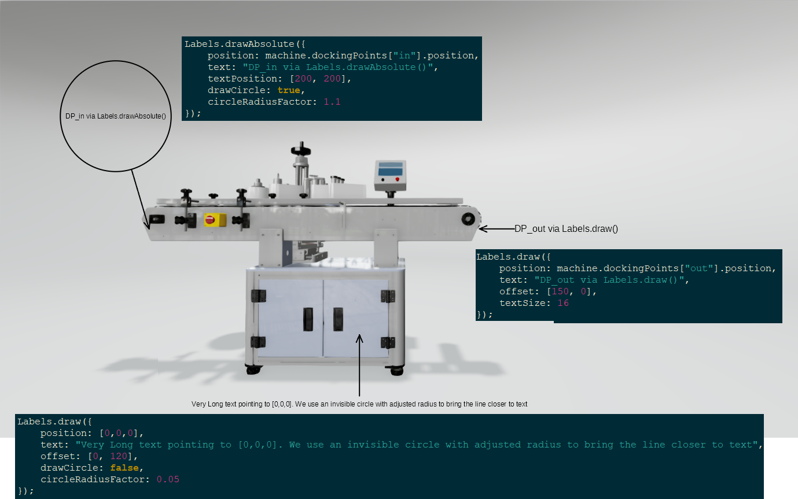

# Labels

A module for creating sketch labels.



For a detailed documentation of the public functions, please see the JSDoc comments
in [src/labels/Labels.js](src/labels/Labels.js).

## Using Labels in VisLogic

```javascript
//any file in vislogic
//import
import { Labels } from "./VisLogicUtilities/src/labels/Labels.js";
//use
Labels.draw({
    position: [1, 2, 3],
    text: "Here is [1, 2, 3]",
    offset: [50, 100]
});
```

## Public Functions
These are the supported public functions you can use in your code.
For function parameters, see below.

| Function name  | Description                                           |
|----------------|-------------------------------------------------------|
| `draw`         | Draws a label with the text relative to the arrow-end |
| `drawAbsolute` | Draws a label with the text absolute on the screen    |


## Parameter Object for draw

The (so far) only public function `draw` uses a parameter object to customize the label.  
It supports the following properties:

| Property           | Value type | Default Value | Description                                                                                                                                                                                                                                         |
|--------------------|------------|---------------|-----------------------------------------------------------------------------------------------------------------------------------------------------------------------------------------------------------------------------------------------------|
| position           | Number[]   | undefined     | Technically optional. Where the arrow-end of the label is. Supports 2D (screen) and 3D (scene) coordinates. If not a valid position, no label will be drawn.                                                                                        |
| text               | String     | ""            | Mandatory. The text to display at the other end of the label-line.                                                                                                                                                                                  |
| offset             | Number[]   | [0, 0]        | Offset Vector in 2D screen coordinates. Relative to the `position`. See official VizStudio documentation for details and axis information.                                                                                                          |
| textSize           | Number     | 12            | Size of the label text in pixel.                                                                                                                                                                                                                    |
| drawCircle         | Boolean    | false         | Whether the text will have a visible circle around it. Note that all texts have an invisible circle around them to limit the length of the line so it does not collide with the text.                                                               |
| circleRadiusFactor | Number     | 1             | Allows fine-tuning of the circle radius around the text. It is a factor with which the calculated circle radius around the text is multiplied by. Use values between 0 and 1 to make the circle smaller. Use values above 1 to embiggen the circle. |


## Parameter Object for drawAbsolute
Same as for draw, except `offset` is meaningless. Instead, use `textPosition`, which is a Number[], containing the 2D screen coordinates of where the text shall be.
