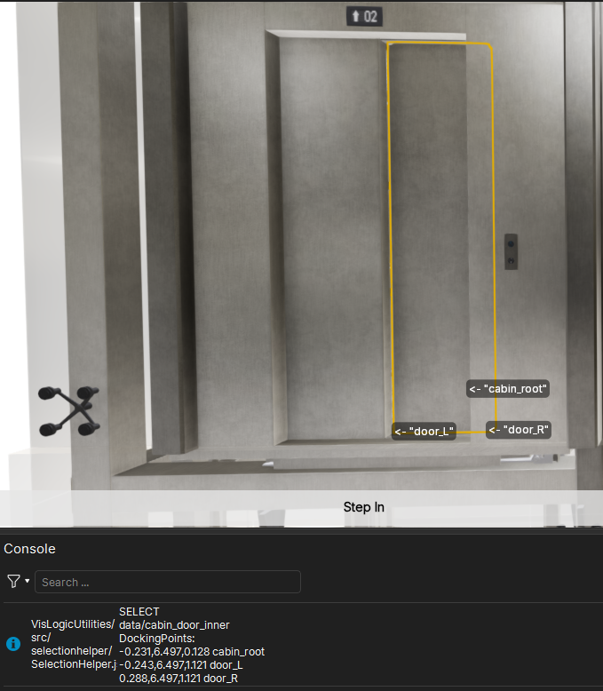

# SelectionHelper

A module for showing useful information when the user selects something in the scene.



For a detailed documentation of the public functions, please see the JSDoc comments
in [src/selectionhelper/SelectionHelper.js](src/selectionhelper/SelectionHelper.js).

## Using SelectionHelper in VisLogic

```javascript
//main.js in vislogic
//import
import { SelectionHelper } from "./VisLogicUtilities/src/selectionhelper/SelectionHelper.js";
//use
core.events.select = (event) => {
    SelectionHelper.handleSelection(event, { 
	  size: 24
    });
}
```

## Public Functions
These are the supported public functions you can use in your code.
For function parameters, see below.

| Function name      | Description                                                    |
|--------------------|----------------------------------------------------------------|
| `handleSelection`  | Selection event handler usually called from core.events.select |


## Parameters  for handleSelection(event, options)

* event - Mandatory. Event object as generated by core.events.select
* options - Optional. Allows you to customize selection behavior. See the table below for supported properties.

| Property              | Value type | Default Value        | Description                                                                  |
|-----------------------|------------|----------------------|------------------------------------------------------------------------------|
| dockingPointPrecision | Number     | 3                    | Optional. Number of decimals for rounding printed docking point coordinates. |
| drawDockingPointNames | Boolean    | true                 | Optional. Whether to draw docking point names as `core.sketches.text`.       |
| color                 | Number[]   | [0, 0, 0, 1]         | Optional. See core.sketches.text in the VizStudio API documentation.         |
| angle                 | Number     | 0                    | Optional. See core.sketches.text in the VizStudio API documentation.         |
| highlightColor        | Number[]   | [0.7, 0.7, 0.7, 0.4] | Optional. See core.sketches.text in the VizStudio API documentation.         |
| size                  | Number     | 12                   | Optional. See core.sketches.text in the VizStudio API documentation.         |

